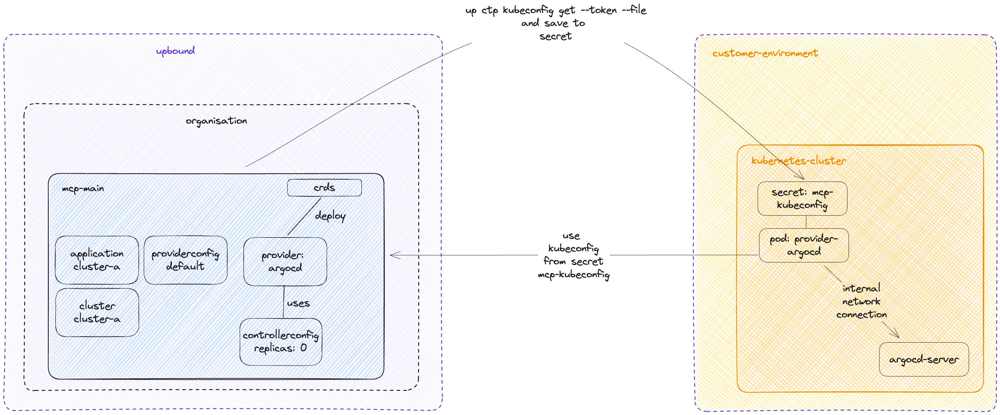

# Bring Your Own Controller (BYOC) base configuration

This repository offers a configuration for Bring Your Own Controller (BYOC) that is built on top of the Cluster-as-a-Service configuration.
https://docs.upbound.io/concepts/mcp/bring-your-own-controller/

In Upbound, `ControllerConfigs` can only be deployed through a Composition.

We're using here an example with [provider-argocd](https://github.com/crossplane-contrib/provider-argocd) to illustrate the Bring Your Own Controller (BYOC) concept.



## Install CRDs in mcp control plane

Please employ this configuration repository in your MCP control plane.

Create a provider-argocd with the following claim. 
In the mcp control plane, this will result in the provider being set up with a `ControllerConfig` where the `replica` is set to `0`.
However, we have all CRDs installed - But it's important to remember that we want to run the provider within your local cluster and local network.

```bash
kubectl apply -f .up/examples/provider-argocd.yaml
```

## Install Internal Provider

The CRDs are now prepared thanks to the provider installation in the previous step. The final step is to install the provider in a local cluster that will reconcile resources in the mcp control plane and make network calls within your internal network.

First, obtain a kubeconfig for your mcp control plane and mount it to your local provider file system. To do this, navigate to the "My Account" section and then the "API Tokens" page in the [console](https://console.upbound.io) to generate a new API token. Use this API token for authentication with your mcp control plane.

Once you have your token ready, execute the following command to generate a kubeconfig in your local file system.

```bash
# Replace CONTROL_PLANE_NAME, ORGANIZATION_NAME and TOKEN with appropriate values.
up ctp kubeconfig get CONTROL_PLANE_NAME --account ORGANIZATION_NAME --token='TOKEN' --file /tmp/kube.yaml
```

Save this kubeconfig as a Secret within your local cluster, which operates in your internal network.
```bash
kubectl create secret generic mcp-kubeconfig -n NAMESPACE --from-file=kubeconfig=/tmp/kube.yaml 
```

Install the local provider that utilizes this Secret in your local cluster.
```bash
kubectl apply  -n NAMESPACE -f .up/examples/local/provider-argocd.yaml
```

You are now set to begin creating your first resources in the mcp control plane.

## Usage
As usual, you need to configure your provider with credentials before creation of any resources.
Always interact with mcp control plane for all operations since that’s what your local provider is watching even if it’s in your cluster and your local network.

```bash
# https://github.com/crossplane-contrib/provider-argocd#create-an-api-token
kubectl create secret generic argocd-credentials -n default --from-literal=authToken="$ARGOCD_TOKEN"
```

```bash
kubectl apply -f .up/examples/providerconfig.yaml
```

Create first resources:

```bash
kubectl apply -f .up/examples/cluster.yaml
kubectl apply -f .up/examples/application.yaml
```

And this is how you can manage resources in your internal network from your mcp control plane.
